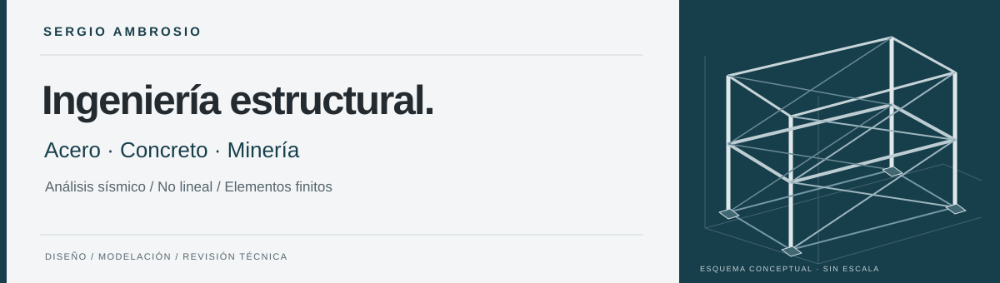

<!-- Generated by portfolio/scripts/build.py from portfolio/data/. -->

# Sergio Junior Ambrosio Camayo

**Ingeniero Civil titulado — Universidad Nacional de Ingeniería (UNI), Facultad de Ingeniería Civil.**

Structural Engineer | Steel, Concrete & Mining | Design Codes & Advanced Analysis | Python & Engineering Automation

Diseño y reviso estructuras de acero y concreto para minería, edificaciones e infraestructura. Actualmente trabajo en **SRK**. Mi trayectoria incluye proyectos en HMV, MRZ, AMEC Foster Wheeler y MIMCO; integro análisis, criterios normativos y programación en Python para apoyar decisiones de ingeniería.

[Portafolio en español](https://sergioambrosio714.github.io/) · [Portfolio in English](https://sergioambrosio714.github.io/en/index.html) · [CV PDF](https://sergioambrosio714.github.io/assets/cv-sergio-ambrosio-es.pdf) · [LinkedIn](https://www.linkedin.com/in/sergio-junior-ambrosio-camayo-668241116/)

### Proyectos seleccionados

- **[SUNSETGOLF TORRE C](https://sergioambrosio714.github.io/proyectos/sunsetgolf-torre-c.html)** · 2024 — Modelación y diseño estructural de una torre multifamiliar de 21 niveles y 3 sótanos.
- **[CEPITOCE / INFRAESTRUCTURA ELÉCTRICA](https://sergioambrosio714.github.io/proyectos/cepitoce-infraestructura-electrica.html)** · 2026 — Diseño y verificación de torres, pórticos y soportes de equipos de alta tensión en HMV Ingenieros.
- **[ALMACENES CIDELSA / YANACOCHA](https://sergioambrosio714.github.io/proyectos/almacenes-cidelsa-yanacocha.html)** · 2024 — Diseño y verificación de una estructura metálica de aproximadamente 20 × 30 m para uso múltiple.

### Investigación y publicaciones

- **2021 · [Performance Of Seismically Isolated Liquid Storage Tanks Using Triple Pendulum Bearings](https://sergioambrosio714.github.io/investigacion/17wcee-tanques-aislados.html)**
- **2018 · [Performance Of Seismically Isolated Water Storage Tanks](https://sergioambrosio714.github.io/investigacion/jornadas-sudamericanas-2018.html)**
- **2018 · [Desempeño Sísmico De Tanques Para Almacenamiento De Agua Con Base Aislada](https://sergioambrosio714.github.io/investigacion/simposio-riesgo-2018.html)**

Soy coautor de un trabajo del **17WCEE** y figuro como expositor en el programa de presentaciones breves en línea (SOP) del congreso híbrido de 2021. Las fichas reúnen las publicaciones, sus fuentes y las actividades académicas relacionadas.

### Normativa, análisis y verificación

En mi práctica utilizo RNE E.020, E.030, E.050 y E.060, además de ACI 318, ASCE/SEI 7, AISC 360, ASCE/SEI 41, ACI 562 y referencias para FRP. El [catálogo normativo](https://sergioambrosio714.github.io/normativa/index.html) distingue las ediciones consultadas y su relación con cada proyecto. Para análisis sísmico y no lineal, elementos finitos y reforzamiento, trabajo con ETABS, SAP2000, SAFE, Mathcad, OpenSeesPy y Abaqus según el problema estructural.

### Python y automatización

- [Resultados por nivel](https://sergioambrosio714.github.io/laboratorio/resultados-por-nivel.html): importar CSV, validar unidades, comparar casos y exportar datos.
- [Voladizo paramétrico](https://sergioambrosio714.github.io/laboratorio/voladizo-parametrico.html): equilibrio, deformación y esfuerzos con solución analítica.
- [Código Python, ejemplos y pruebas](https://github.com/SergioAmbrosio714/SergioAmbrosio714.github.io/tree/main/python).

Presento dos demostradores creados para este portafolio en octubre de 2026, independientes de los proyectos profesionales anteriores. Uso Python como apoyo a la revisión, con procedimientos que permiten comprobar unidades, seguir los cálculos y reproducir resultados.

[Notas técnicas](https://sergioambrosio714.github.io/#notas) · [Experiencia profesional](https://sergioambrosio714.github.io/#experiencia) · [Structural Lab](https://sergioambrosio714.github.io/#herramientas)
